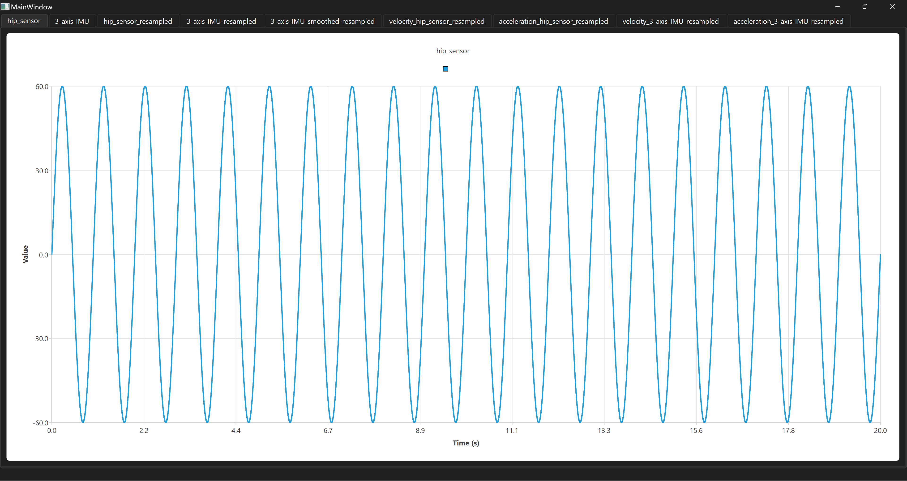
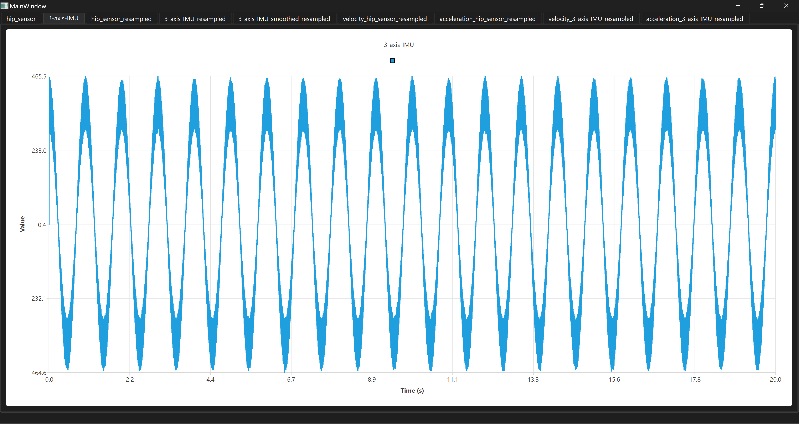
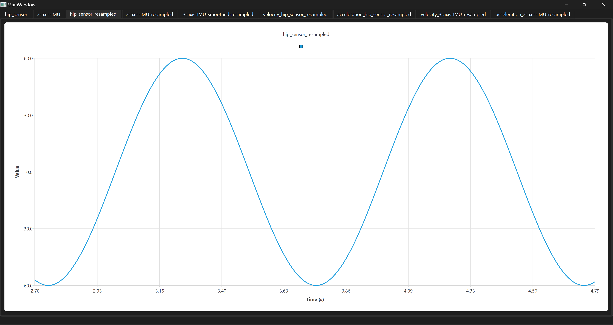
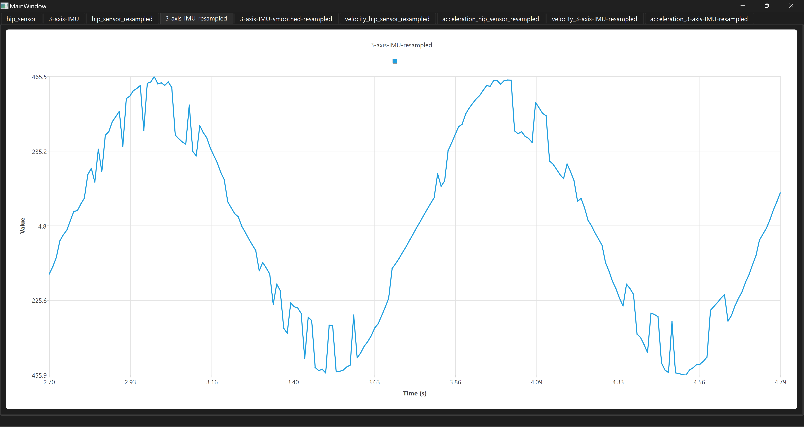
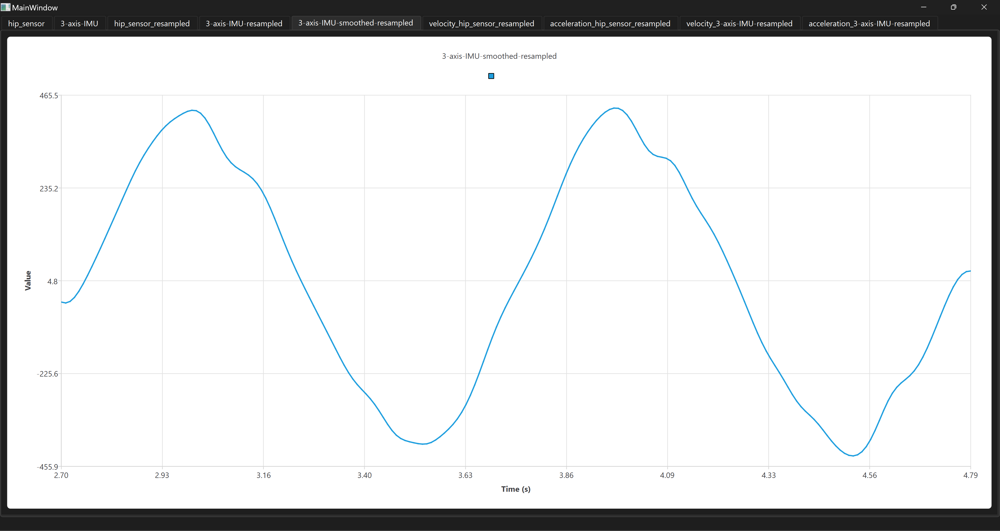
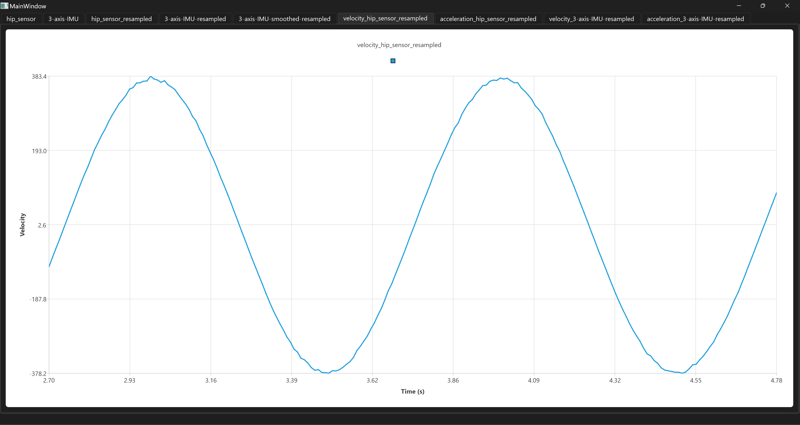
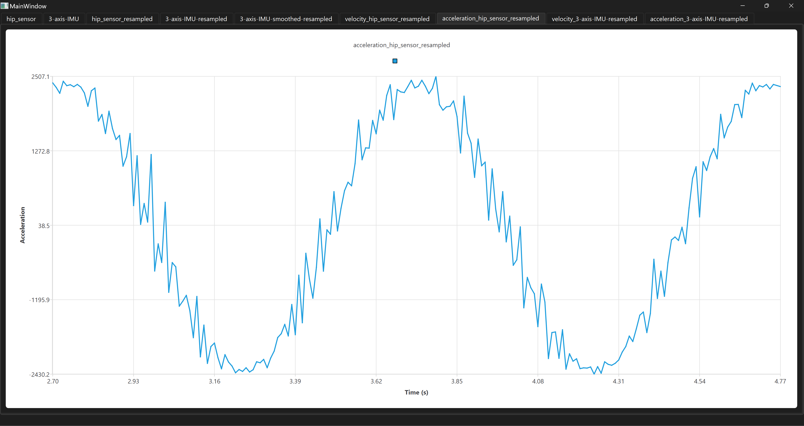
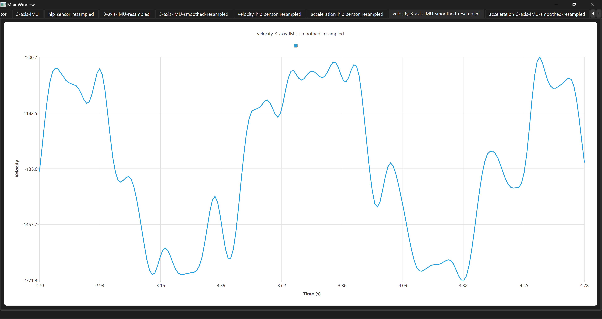
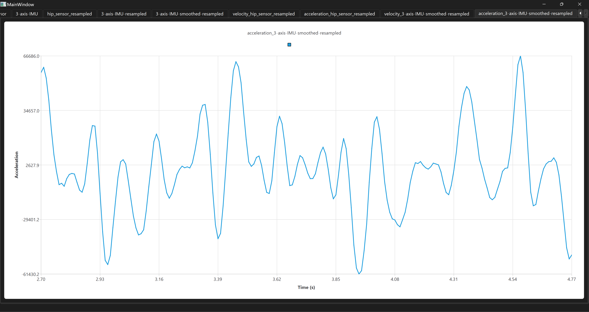

# Twiice Exo Project

This project is a coding exercise for Twiice, demonstrating the use of Qt in C++ to process and visualize sensor data.

## Description

The project involves creating a Qt application that:
1. Generates artificial data from sensors.
2. Resamples the data.
3. Finds peaks in the data.
4. Calculates velocity and acceleration.
5. Visualizes the results using charts.

## Results

Here are the screenshots of the results:

### Hip Sensor Data

### IMU Data

### Resampled Hip Sensor Data

### Resampled IMU Data

### Smoothed IMU Data (Gaussian)

### Hip Sensor Velocity

### Hip Sensor Acceleration

### IMU Velocity

### IMU Acceleration

## How to Run

1. Clone the repository.
2. Open the project in Qt Creator.
3. Build and run the application.

## Contact

For any questions, please contact `coding@twiice.ch`.
